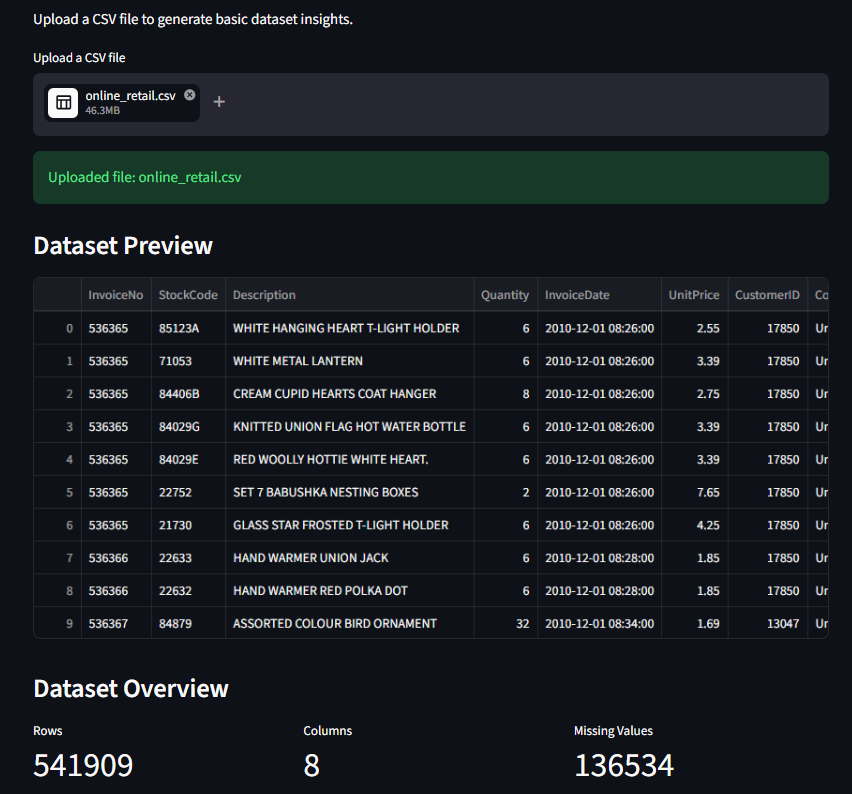
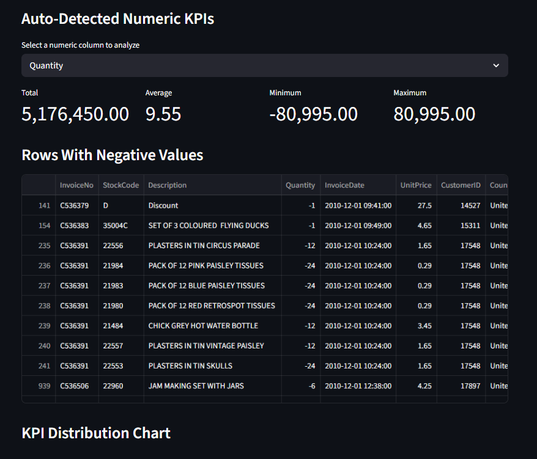

# 📊 AI Analytics Copilot

An AI-powered analytics dashboard built using Streamlit, Pandas, Plotly, and LLM APIs to automate KPI analysis, anomaly detection, and business insight generation from structured datasets.

---

## 🚀 Features

- CSV dataset upload
- Automatic KPI generation
- Statistical summaries
- Interactive visualizations
- Outlier detection
- Rule-based business insights
- AI-generated business recommendations
- Streamlit dashboard interface

---
---

## 📸 Application Screenshots

### Dashboard Overview



---

### Analytics & Outlier Detection



---

### AI Generated Insights


---

## 🛠️ Tech Stack

- Python
- Streamlit
- Pandas
- Plotly
- Groq API (LLM)
- dotenv

---

## 📈 Current Functionalities

### Data Analysis
- Dataset preview
- Missing value detection
- Column analysis
- Statistical summaries

### KPI Analytics
- Total
- Average
- Minimum
- Maximum

### Visualization
- Histogram charts
- Box plots
- Top-value analysis

### AI Features
- AI-generated business insights
- Trend analysis
- Risk identification
- Actionable recommendations

---

## 🔥 Example Use Cases

- Sales analytics
- Customer behavior analysis
- Inventory analysis
- Financial anomaly detection
- Business KPI monitoring

---

## ⚙️ Installation

### Clone repository

```bash
git clone https://github.com/revaanaik1999/ai-analytics-copilot.git
```

### Navigate to project

```bash
cd ai-analytics-copilot
```

### Create virtual environment

```bash
python -m venv venv
```

### Activate virtual environment

#### Windows
```bash
.\venv\Scripts\activate
```

#### Mac/Linux
```bash
source venv/bin/activate
```

### Install dependencies

```bash
pip install -r requirements.txt
```

---

## 🔑 Environment Variables

Create a `.env` file:

```env
GROQ_API_KEY=your_api_key_here
```

---

## ▶️ Run the application

```bash
python -m streamlit run app.py
```

---

## 📌 Future Enhancements

- Conversational analytics chatbot
- Forecasting models
- PDF report generation
- Database connectivity
- Azure AI Foundry integration
- Natural language querying

---

## 👩‍💻 Author

**Revaa Naik**

- GitHub: https://github.com/revaanaik1999
- LinkedIn: https://linkedin.com/in/revaanaik
